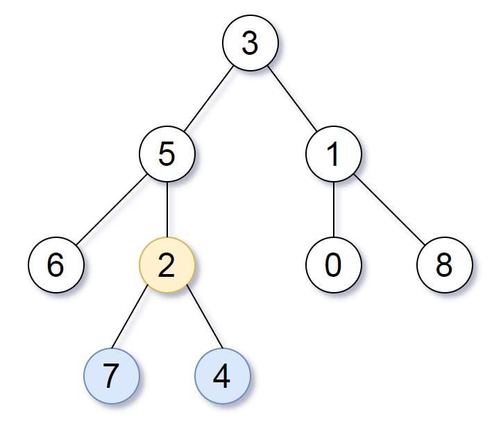

# 树类题目
## 具有所有最深节点的最小子树
### 题目描述：
给定一个根为root的二叉树，每个节点的深度是 该节点到根的最短距离 。

如果一个节点在**整个树**的任意节点之间具有最大的深度，则该节点是**最深的**。

一个节点的**子树**是该节点加上它的所有后代的集合。

返回能满足 以该节点为根的子树中包含所有最深的节点 这一条件的具有最大深度的节点。

来源：力扣（LeetCode）
链接：https://leetcode-cn.com/problems/smallest-subtree-with-all-the-deepest-nodes
